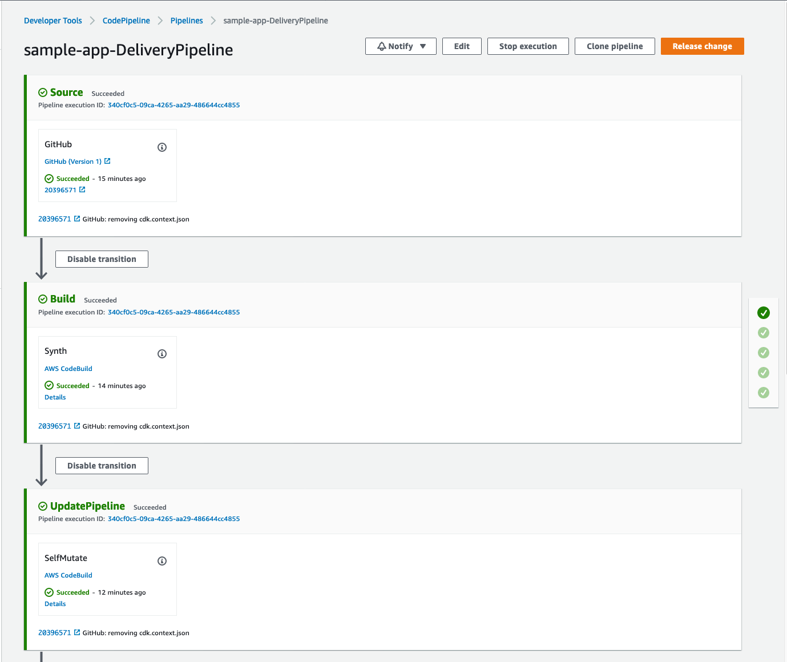
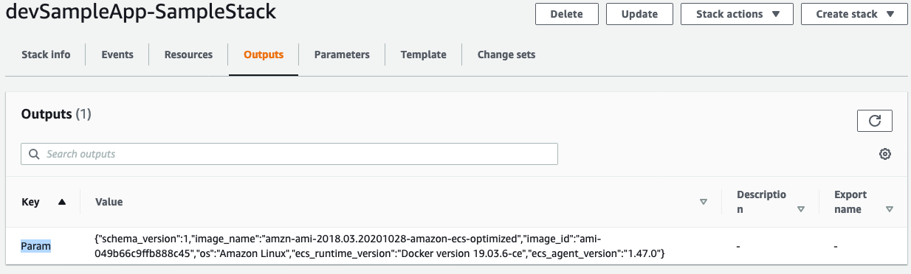

# Plugin Sample App using CDK Pipelines

This is a sample app to show how to use the cdk-assume-role-credential-plugin
with the [CDK Pipelines](https://aws.amazon.com/blogs/developer/cdk-pipelines-continuous-delivery-for-aws-cdk-applications/) Construct

## Overview
In this sample app you will use the [cdk-assume-role-credential-plugin](../README.md) to read information from multiple
AWS Accounts as a part of the synthesis process. For the rest of the walkthrough it will assume the use of three AWS Accounts.
You can use any three accounts, but the role they will
play in the walkthrough are described below:

1. Shared Services Account: This account is where you will run the CDK commands from, and will have access to assume role into the other two AWS Accounts.
This is where you will also deploy a pipeline to automate the deployment of your CDK application.
3. Development Application Account: This account is used as the development environment for the CDK application.
4. Production Application Account: This account is used as the production environment for the CDK application.

## Prerequisites

To deploy the sample application in this repo you will need to first make sure
you have a couple of things setup.

1. You will need a GitHub account and will need to create a GitHub repository named `cdk-sample-pipelines-app`.
3. Within the Shared Services AWS account you will need to store a GitHub personal access token as a plaintext secret (not a JSON secret)
in AWS Secrets Manager under the name `github-token`

Before we begin you will need to clone this repo locally and remove the `.git` directory.

```bash
$ git clone https://github.com/aws-samples/cdk-assume-role-credential-plugin.git
$ cd cdk-assume-role-credential-plugin
$ rm -rf .git
```

## Setup
Navigate to the `cdk-sample-pipelines-app` folder and link it to your GitHub repo you created as
part of the prerequisites.

**replace `aws-samples` org with your GitHub org**
```bash
$ cd cdk-sample-pipelines-app
$ git init
$ git add .
$ git commit -m "first commit"
$ git branch -M main
$ git remote add origin git@github.com:aws-samples/cdk-sample-pipelines-app.git
$ git push -u origin main
```

Now install our NPM dependencies

```bash
$ npm install
```

Now lets update our app and replace some of the placeholder values.

1. Edit the [bin/required-resources.ts](bin/required-resources.ts) file & fill in the AWS Account numbers where indicated.
```typescript
const dev = { account: 'REPLACE_WITH_DEV_ACCOUNT_ID', region: 'us-east-2' }
const prod = { account: 'REPLACE_WITH_PROD_ACCOUNT_ID', region: 'us-east-2' }
const trustedAccount = 'REPLACE_WITH_SHARED_SERVICES_ACCOUNT_ID';
```

2. Open the `lib/pipeline-stack.ts` file. This is where we define our
pipeline infrastructure using CDK Pipelines. Replace the placeholder value
for `owner`.

3. Edit the [bin/sample-app.ts](bin/sample-app.ts) file & fill in the AWS Account numbers where indicated.

Now build the app again to incorporate these changes

```bash
$ npm run build
```

## Create Required Resources

Since this plugin uses pre-provisioned roles in the target AWS Account, you will need to first create those roles.
Because we are working with [CDK Pipelines](../README.md#new-style-synthesis) we only need to create the `readOnlyRole` which allows us to perform context lookups.
We will create a single IAM role with the name `cdk-readOnlyRole` and will have the ReadOnlyAccess AWS Managed Policy attached.
The role is also configured to trust the Shared Services account.


1. Using CLI credentials for the Dev AWS Account, run cdk deploy to create the resources
```bash
$ cdk deploy –-app "npx ts-node bin/required-resources.ts" dev
```

2. Using CLI credentials for the Prod AWS Account, run cdk deploy to create the resources
```bash
$ cdk deploy –-app "npx ts-node bin/required-resources.ts" prod
```

Now you should have the required roles created in both the Dev and Prod AWS Accounts.

## Bootstrap environment

Before you deploy the application you need to make sure the environment
where you are planning to deploy the pipeline to has been bootstrapped,
specifically with the newest version of the bootstrapping stack.

You will need to bootstrap every environment you plan to deploy the CDK
application to, which in this example is the dev and prod accounts.

You only need to do this one time per environment where you want to deploy
CDK applications. If you are unsure whether your environment has been
bootstrapped already, you can always run the command again.

Run the below two commands to bootstrap each of our accounts. Make
sure to run the command using credentials for that specific account.
You can reference [this section](../README.md#new-style-bootstrap) if you want
to use the plugin for bootstrapping as well.

**dev account**
```bash
$ npx cdk bootstrap --trust REPLACE_WITH_SHARED_SERVICES_ACCOUNT_ID --cloudformation-execution-policies arn:aws:iam::aws:policy/AdministratorAccess aws://REPLACE_WITH_DEV_ACCOUNT/us-east-2
```

**prod account**
```bash
$ npx cdk bootstrap --trust REPLACE_WITH_SHARED_SERVICES_ACCOUNT_ID --cloudformation-execution-policies arn:aws:iam::aws:policy/AdministratorAccess aws://REPLACE_WITH_PROD_ACCOUNT/us-east-1
```

Once it is finished bootstrapping, we can provision the pipeline. Since the pipeline will run as soon
as it is created we want to make sure that our code has been committed to git.

```bash
$ git add .
$ git commit -m "updating placeholders"
$ git push
```

## Deploy the Pipeline

Now we will deploy the pipeline using `cdk deploy`. This is the only time we will need to run a cdk command locally,
all future updates will run through the pipeline. Before creating the pipeline make sure you have stored your GitHub token
in Secrets Manager. If you haven't done this already, you can do this from the AWS CLI with the command:

```bash
$ aws secretsmanager create-secret --name github-token --secret-string "REPLACE_WITH_GITHUB_TOKEN"
```

Run the below commands to create the pipeline which will create the infrastructure for our application
as well as deploy the application.

```bash
$ npx cdk deploy '*'
```

Login to the console to view the pipeline execution.



## Validate that the plugin worked

Once the pipeline completes you can validate that the context lookups were able to be performed.

You can either login to the console and view the CloudFormation Stack outputs



Or you can run the below CLI commands.

__remember to use the credentials for the respective accounts__

**dev account**
```bash
$ aws cloudformation describe-stacks --stack-name devSampleApp-SampleStack --query 'Stacks[].Outputs[?OutputKey==`Param`].OutputValue' --output text --region us-east-2
```

**prod account**
```bash
$ aws cloudformation describe-stacks --stack-name prodSampleApp-SampleStack --query 'Stacks[].Outputs[?OutputKey==`Param`].OutputValue' --output text --region us-east-1
```

## Cleaning up
To avoid incurring future charges, delete the resources.

Delete the Pipeline stacks by running the below command:

```bash
$ npx cdk destroy '*'
```

To clean up the rest of the stacks, log into the AWS console for each account (dev/prod).

For the `dev` account go to the AWS CloudFormation console in the `us-east-2` region.
Click on the following stacks and select delete: `devSampleApp-SampleStack`, `CDKToolkit`.

For the `prod` account go to the AWS CloudFormation console in the `us-east-1` region.
Click on the following stacks and select delete: `prodSampleApp-SampleStack`, `CDKToolkit`.

You can also do this from the AWS CLI by running the below commands. You will need to make sure the first three stacks are
deleted prior to deleting the CDKTookit stack, and you may need to first empty the S3 Bucket created by the stack before
CloudFormation will allow you to delete it.

```bash
$ aws cloudformation delete-stack --stack-name devSampleApp-SampleStack --region us-east-2
$ aws cloudformation delete-stack --stack-name prodSampleApp-SampleStack --region us-east-1
--- wait for above to finish deleting --
$ aws cloudformation delete-stack --stack-name CDKToolkit --region us-east-2
$ aws cloudformation delete-stack --stack-name CDKToolkit --region us-east-1
```
